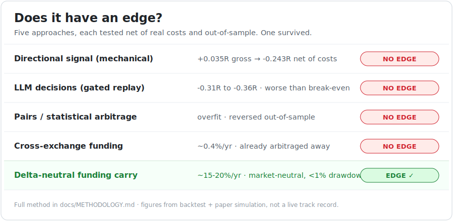
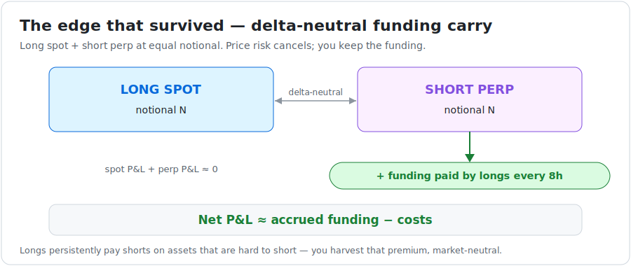

# Sentinel Trader

A crypto trading research project — and an honest record of what happened when I
tested it for a real edge.

It started as an AI-driven directional bot: deterministic market features →
LLM trade suggestions → a multi-gate risk engine → paper/live execution. Then I
did the thing most trading projects skip: I tried, rigorously, to **disprove**
that it made money. It didn't. So I kept testing — pairs, stat-arb,
cross-exchange — and disproved those too. One strategy survived: a
**delta-neutral funding carry** on high-consistency altcoin perpetuals.

This repo contains both halves: the full directional bot (which has **no edge**,
and I can show you why) and the carry strategy (which has a **real, structural,
but small** edge). The whole point is the methodology — see
**[docs/METHODOLOGY.md](docs/METHODOLOGY.md)**.

> **Read [DISCLAIMER.md](DISCLAIMER.md) first.** Educational/research only. Not
> financial advice. Paper by default. Trading risks total loss. As published,
> the carry edge is backtested and paper-tested, **not** proven over a long live
> track record.

<p align="center">
  
</p>

---

## The one-paragraph summary

Most "edges" are illusions that vanish once you account for real costs or test
out-of-sample. The directional bot's mechanical signal was **+0.035R gross but
−0.243R after realistic slippage and fees**. The LLM layer (Cerebras and Gemini,
tested on a gated replay) did **not** beat break-even. Pairs/stat-arb was
overfit — every pair that looked good in-sample reversed out-of-sample.
Cross-exchange funding differences were already arbitraged to ~0.4%/yr. The only
thing that held up under honest cost accounting was harvesting funding on
perpetuals that are *structurally* hard to short, where longs persistently pay
shorts. Held delta-neutral (long spot + short perp), that pays roughly
**10–20%/yr, market-neutral**, with a hard **capacity ceiling around $100k**.

<p align="center">
  
</p>

## Architecture

| Module | Role |
|--------|------|
| `sentinel.carry` | **The strategy that survived.** Scanner, simulator, delta-neutral position, risk-parity book, manager, persistence, 24/7 runner |
| `sentinel.core` | Scheduler, pipeline orchestration, positions, daily report (directional bot) |
| `sentinel.data` | CCXT market data, deterministic features, historical cache |
| `sentinel.ai` | LLM client, prompts, reflection, offline dataset tooling |
| `sentinel.risk` | Multi-gate risk engine, sizing, kill switch |
| `sentinel.exec` | Broker interface, paper/MEXC execution |
| `sentinel.backtest` | Backtest engine, **LLM gated replay**, cost sweep — the disproof tools |
| `sentinel.store` | SQLite (WAL) persistence |
| `sentinel.admin` | Telegram admin bot |

The carry strategy is deliberately split into a **pure, unit-tested core**
(scoring, sizing, accounting, scheduling) and a thin **network/time layer**
(price fetch, the loop). That's why it's testable and restart-safe.

## Quick start (paper)

Requires **Python 3.12+**.

```bash
git clone https://github.com/blitzcrieg1/sentinel-trader-research.git
cd sentinel-trader-research

python -m venv .venv
# Windows:  .\.venv\Scripts\Activate.ps1
# Linux/macOS:  source .venv/bin/activate

pip install -e .
cp .env.example .env   # defaults are paper-safe
```

**Run the carry strategy (paper, no exchange keys needed — public data only):**

```bash
python -m sentinel.carry.run --capital 10000 --state data/carry_book.json -v
```

It scans MEXC perpetuals, curates a basket by funding *consistency*, opens
simulated delta-neutral hedges, accrues funding every 8h (00/08/16 UTC), and
persists the book so it survives restarts. Add `TELEGRAM_BOT_TOKEN` +
`TELEGRAM_ADMIN_CHAT_ID` to `.env` for 8-hourly reports (optional).

**Run the directional bot (paper):**

```bash
python -m sentinel.main
```

It needs an LLM key (`GEMINI_API_KEY`) and uses `dummy` MEXC keys for paper. It
works — it just doesn't have an edge. That's the point.

## Tests

```bash
pytest          # carry core: scoring, sizing, delta-neutral accounting, persistence
ruff check .
mypy sentinel/
```

## Validate the edge yourself (walk-forward, OOS)

The sharpest objection to a consistency-screened basket is survivorship/look-ahead
bias. `sentinel/carry/walkforward.py` confronts it: at each rebalance the basket
is picked on **past-only** data, scored on the **next, unseen** window, then
bootstrapped into a 95% CI and compared to a random-selection baseline.

```bash
python -m sentinel.carry.walkforward --scan --train 600 --test 120 --top-n 6 -v
```

If the edge only existed in hindsight, the out-of-sample yield collapses to the
baseline and the CI straddles zero. The no-look-ahead property is unit-tested. See
[docs/METHODOLOGY.md](docs/METHODOLOGY.md) §5.5.

And because capacity is the whole story for a thin-market edge, `capacity.py`
turns the "~$100k ceiling" into a net-yield-vs-notional **curve** (square-root
market impact + participation cap + a sensitivity band):

```bash
python -m sentinel.carry.capacity --symbol XMR_USDT -v
```

## Deployment

Linux + `systemd`. Units are in `deploy/` — `sentinel-carry.service` (the
strategy) and `sentinel-trader.service` (the directional bot). Both run fine on
a small always-on box (a Raspberry Pi or a cheap mini PC). The carry book uses
atomic writes and SQLite uses WAL, so a power loss won't corrupt state.

## What this project is — and isn't

- **It is** an honest, end-to-end study of whether a retail crypto edge exists,
  with the code to reproduce every finding.
- **It is** a working, market-neutral carry harvester with a structural reason
  to work and modest, capacity-limited returns.
- **It is not** a way to get rich from a small stake. A ~15% market-neutral
  return is excellent — but 15% of a small number is a small number. At small
  capital, your savings rate matters far more than any strategy's return.
- **It is not** financial advice or a turnkey money machine. See
  [DISCLAIMER.md](DISCLAIMER.md).

## Related work — and how this differs

Funding carry is **not new**, and this repo doesn't claim to have discovered it.
It's one of the most replicated ideas in crypto, and the structural reason it
works is well documented — a [BitMEX study](https://markets.financialcontent.com/chroniclejournal/article/gnwcq-2025-10-14-bitmex-study-finds-cryptocurrency-funding-rates-positive-92-of-the-time)
found funding is positive ~92% of the time. There are many implementations:

- **Execution / detection bots** — e.g.
  [aoki-h-jp/funding-rate-arbitrage](https://github.com/aoki-h-jp/funding-rate-arbitrage),
  [ARBOT](https://github.com/IrakliXYZ/ARBOT),
  [HL-Delta](https://github.com/cgaspart/HL-Delta). These detect funding
  opportunities and run the delta-neutral trade. They're useful — but they're
  *execution engines*: none ship walk-forward validation, an out-of-sample
  permutation/selection-bias guard, or a capacity curve.
- **Academic** — e.g. a [leveraged BTC carry study](https://papers.ssrn.com/sol3/papers.cfm?abstract_id=5292305)
  (~16%/yr, Sharpe 6.1). Rigorous, but single-asset and theoretical.
- **Honest "AI bot" writeups** — e.g.
  [Jiri Dolejs' LLM trading bot](https://medium.com/@kojott/i-built-an-ai-trading-bot-and-let-it-trade-for-9-days-heres-what-happened-6ceb69ad4d08),
  which independently reaches the same conclusion about LLM signals that §2 does.

What this repo adds is **not the strategy — it's the discipline around it**:

1. A documented **disproof** of the strategies that *don't* survive (directional,
   LLM, pairs, cross-exchange), so the carry isn't presented in a vacuum.
2. A **validation layer** the execution bots skip — walk-forward + bootstrap, a
   permutation test for selection bias, and a capacity curve, all runnable.
3. **Honest limitations** ([METHODOLOGY §6](docs/METHODOLOGY.md)), including the
   parts that are unproven or only operationally mitigable.

The edge is the crowded part; the rigor and the candor are the point.

---

*Built and tested in paper. The hardest and most valuable result here was
learning to disprove my own ideas with data.*
